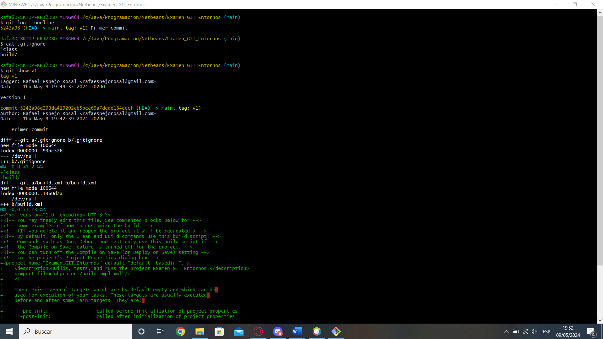
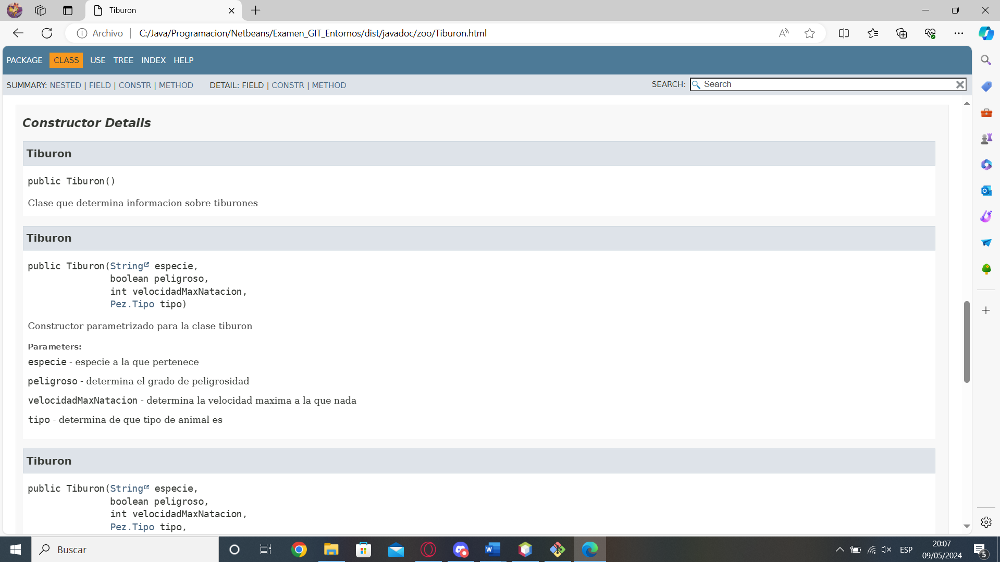
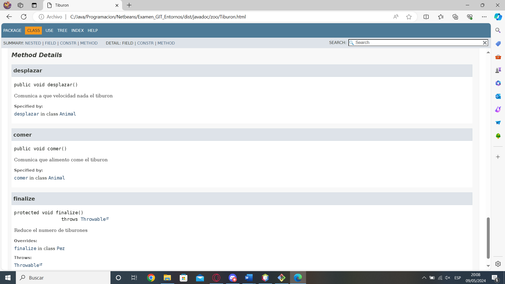
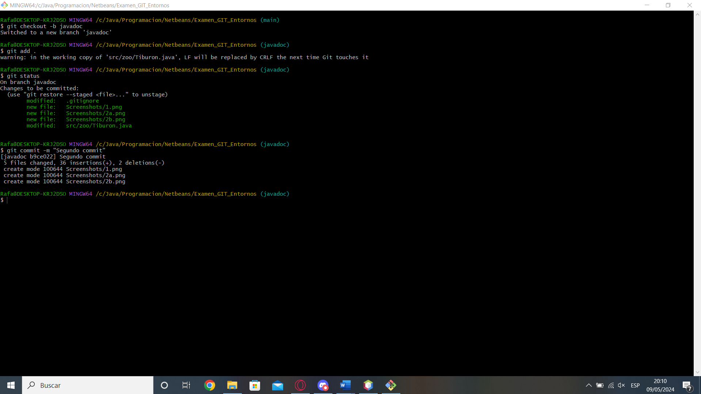
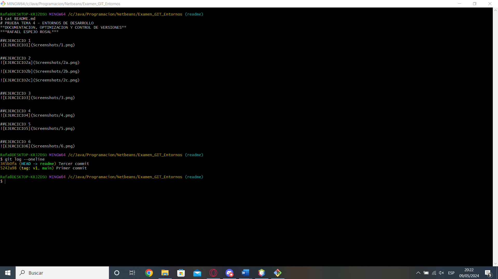
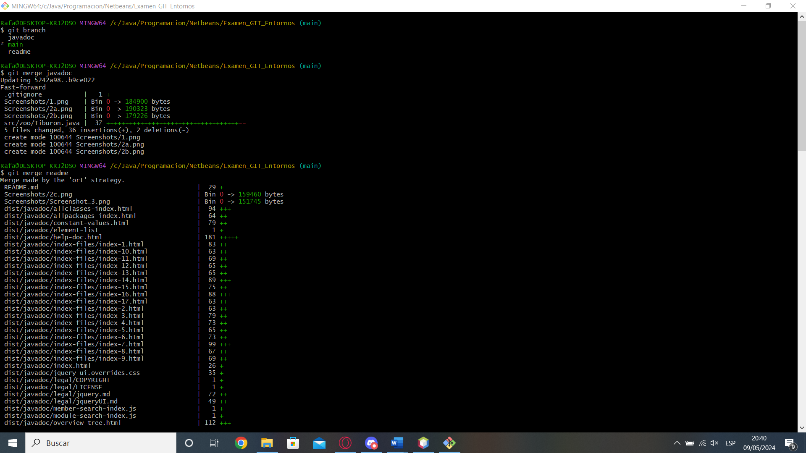
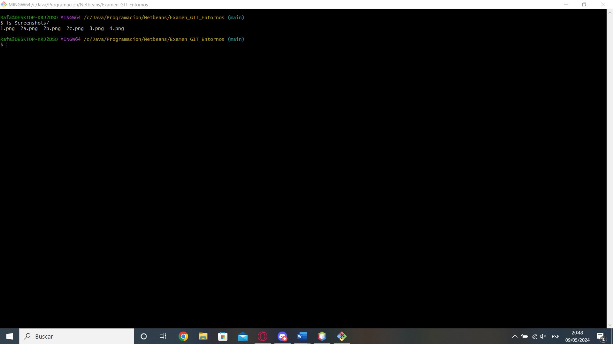
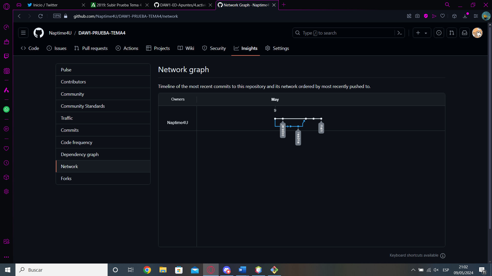

# PRUEBA TEMA 4 - ENTORNOS DE DESARROLLO
**DOCUMENTACION, OPTIMIZACION Y CONTROL DE VERSIONES**
***RAFAEL ESPEJO ROSAL***

##EJERCICIO 1

##EJERCICIO 2

##EJERCICIO 3

##EJERCICIO 4

##EJERCICIO 5

##EJERCICIO 6

